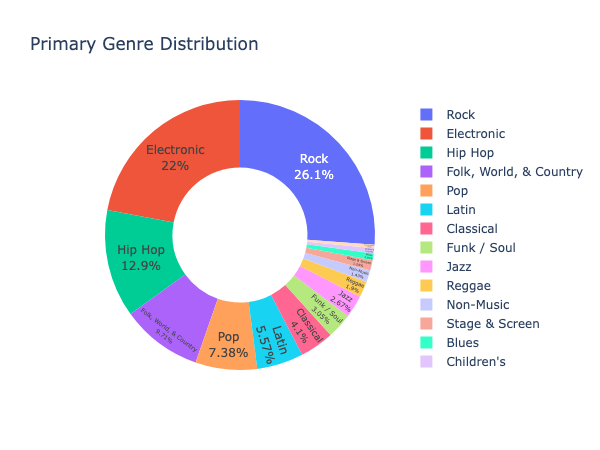
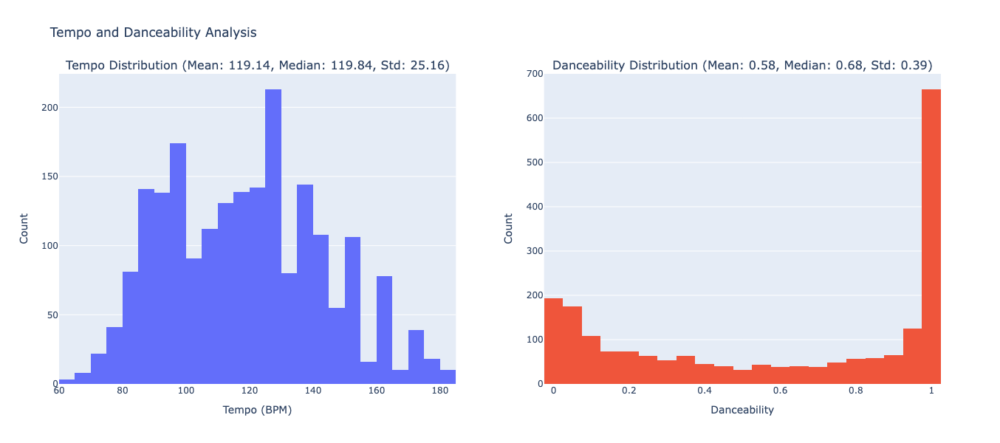
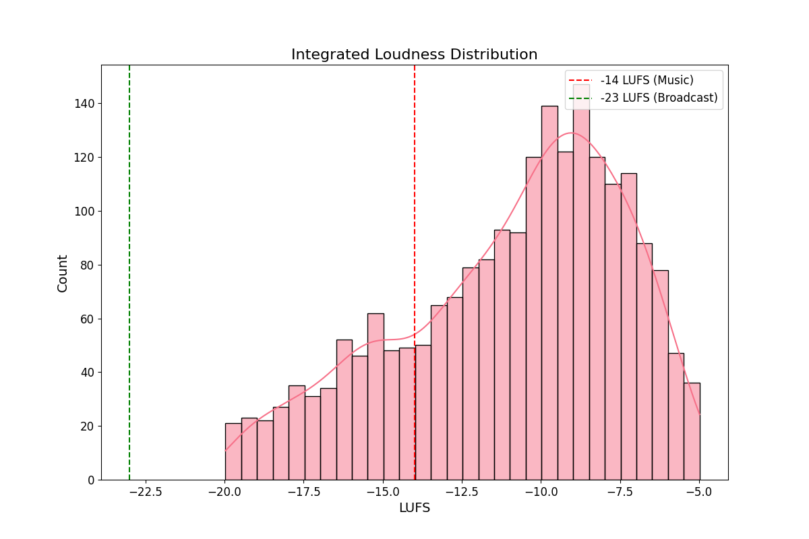
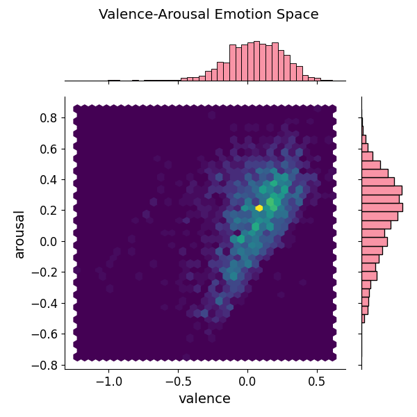
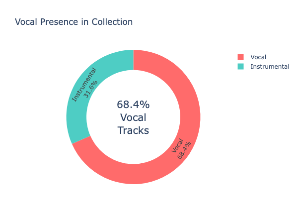

# Report
   Report Generation Notebook with analysis & interactive plots can be found [here](analysis_report.ipynb)

## 1. **Music Style Diversity**

- The collection is **diverse but a bit unbalanced** with **Rock, Electronic and Hip-Hop** parent genres accounting for more than half of the music.

[Genre & Style Distribution](reports/genre-style-bars.png) &  [Genre & Style Treemap](reports/genre-styles-treemap.png)

---

## 2. **Tempo & Danceability**

**Tempo Analysis:**
- Most tracks cluster around **120–140 BPM** which is common for **Electronic and Rock** music, (which are the top 2 genres) with outliers at **170-180** BPM.
- **[Peaks/Valleys]** at **80-100 BPM** likely from a lot of **[Hip-Hop]** which is the top third genre.

**Danceability Analysis:**
- A significant number of tracks have very low danceability (close to 0), suggesting a portion of the dataset consists of non-danceable or more rhythmically complex music.
- Another strong peak appears near the maximum danceability value (close to 1), indicating a substantial number of highly danceable tracks.
- The middle range (0.3 to 0.7) appears relatively underrepresented, suggesting that tracks tend to be either distinctly danceable or not, rather than falling into an intermediate zone.

---

## 3. **Key & Scale Analysis**

**Key Agreement:**
- All three profiles agree on only just above **50%** of tracks so the three algorithms often disagree. 

**Profile Comparison:**
- **Temperley:** Favors **major** keys (e.g., **C, F, G Major**).
- **Krumhansl:** shows better consistency with the majority trends (key counts, percentage breakdowns across major/minor) than the other two. 

#### [Key Analysis 2](reports/key-analysis-grouped.png)

---

## 4. **Loudness Distribution**

- The loudness distribution of dataset, ranging from **-22.5 LUFS to -5.0 LUFS**, shows significant variability. 
- Peak near **-8 to -9 LUFS** aligns with **the majority of tracks being rock and pop tracks**.
- **Y%** of tracks exceed -14 LUFS ("loudness war" artifacts), while none are below -23 LUFS (*broadcast target*).

### Loudness Distribution

### Loudness Analysis with Common Targets
[Loudness Analysis with Targets](reports/loudness-analysis.png )

### Loudness-Genre Analysis
[Loudness-Genre Analysis](reports/loudness-genre-boxplots.png)

---

## 5. **Emotional Landscape**

### **Quadrant Analysis:**
#### [Emotion Landscape](reports/emotion-landscape.png) &  [Emotion Space Joint Plot](reports/emotion_space_quadrants.png)

---

## 6. **Vocal/Instrumental Balance**

**Breakdown:**
- **Vocal:** **68.4%**
- **Instrumental:** **31.6%** 

---

# Final Recommendations

1. **Balance & Diversity** - Is this collection diverse in terms of music styles, tempos, tonality, emotion, etc?
Yes and No. As observed above, the collection is
- diverse in terms of music styles, although heavily focused on Rock, Electronic and Hip-Hop
- diverse in terms of tempos with peaks and valleys in certain sections
- diverse in terms of tonality since it spans across multiple keys and scales with A minor, C Major, minor, F major and G major being the most common
- not very diverse in terms of the emotion space since most of the music is concentrated in Q1 quadrant with positive valence and positive arousal.

2. **Key Profile Selection:** If we had to select only one profile to present to the users, we should use **Krumhansl** as it provides counts that align more systematically with the expected distribution for the genres in the collection.

3. Does the Loudness Distribution Make Sense?  
   **No, there is an extreme spread.**  
   - The range from -22.5 to -5.0 LUFS is unusually wide. While genres like classical/acoustic might lean quieter (-16 to -14 LUFS), the high presence of Electronic music (second most common genre) explains the extremely loud peaks at -5 LUFS, though even then this is aggressive.
   - A healthy library should primarily sit between -14 LUFS (streaming target) and -8 LUFS (loud-but-safe). Extremely quiet or loud tracks indicate inconsistency in mastering practices.  
      - **Target -14 to -10 LUFS:** This range balances loudness and dynamics, ensuring compatibility across streaming platforms.  
      - **Avoid Over-Compression:** Tracks above -8 LUFS often sacrifice dynamic range and clarity.  
      - **Normalize Quiet Tracks:** Bring sub -14 LUFS tracks closer to -14 LUFS to prevent volume inconsistencies on platforms like YouTube.  

---