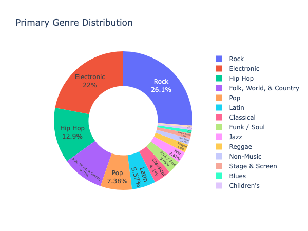
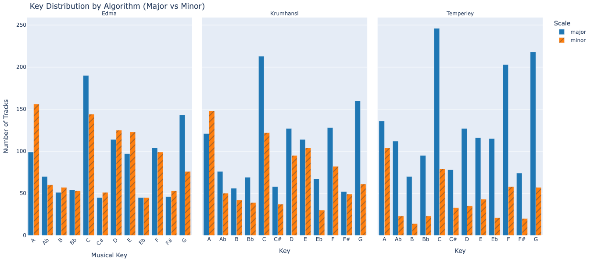
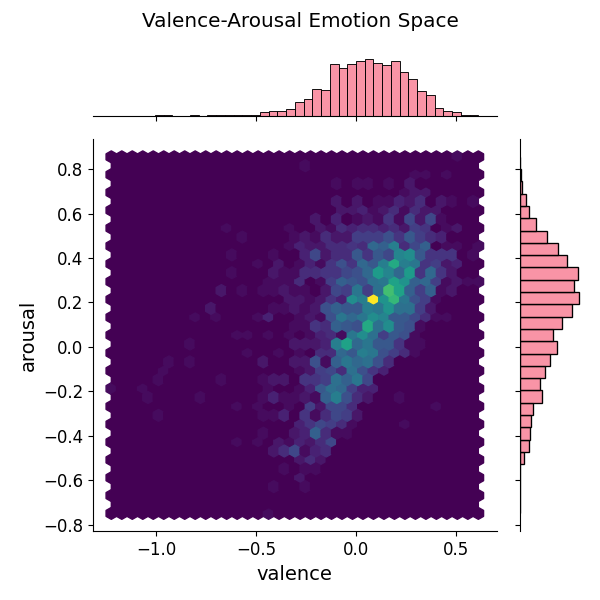
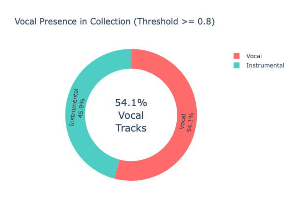

# Report

      Report on Feature Generation, Statistics Overview, and Interface Building

   Report Generation Notebook with analysis & interactive plots can be found [here](analysis_report.ipynb)

## Decisions, Observations and Motivation

### Decisions

   1. Feature Generation:
      - File Preprocessing & Audio Features Processing
         - Our script leverages multiprocessing to parallelize the processing of audio files, significantly reducing the time required for analysis. By utilizing multiple CPU cores, the script can handle multiple audio files concurrently, improving efficiency. This approach allows for faster extraction of audio descriptors, making it feasible to analyze large music collections in a shorter time frame.
         - To avoid reloading the audio file, we use AudioLoader for initial loading, then apply MonoMixer to convert to mono, and finally use Resample (to 16KHz) for TensorFlow model compatibility. This streamlined approach ensures efficient audio file processing without redundant loading.
      - Audio features such as tempo, danceability, loudness, and key were extracted:
         - Experiments were first conducted in a [notebook](notebooks/audio_analysis.ipynb.)
         - Tempo was computed using RhythmExtractor2013 as TempoCNN yielded no improvement.
         - Danceability was calculated using the TensorFlow model.
      - Genres and styles were parsed by splitting strings using multiple delimiters (e.g., genre---style) to enhance subgenre and styles analysis.
         - We extracted, analyzed, and visualized all music styles by grouping them into their respective genres and subgenres, making the analysis more manageable than working with 400 individual styles.
      - Normalization of Valence and Arousal
         - Valence and arousal data was stored in its full range [1,9].
         - For analysis and filtering, values were normalized to fall between -1 and 1.
         - This normalization enables the division of the data into four distinct quadrants, simplifying the interpretation of emotional states.
         - A threshold of 0.8 voice probability was empirically determined to effectively distinguish between vocal and instrumental tracks, based on observations within my own music library.
      - For track similarity, we also adopted a systematic approach, implementing not just n-number of similar tracks but also a similarity percentage metric to evaluate whether tracks meet a user-defined threshold.

   2. Statistics Overview:
      - Calculated measures (mean, median, std, variance) for audio features provide a robust quantitative overview.
      - Visualizations are available both statically and interactively (using Plotly) for flexible exploration of distributions.
   
   3. Interface Building

   The user interface has been consolidated into a singular, Streamlit app, enabling users to query descriptors and perform similarity searches to generate playlists directly on their computer. The app is located within the playlist_generation/ directory and is composed of several key components:

### Motivation and Justification

   This unified interface is designed for flexibility and ease of use. By consolidating all functionalities into one Streamlit app, users benefit from a seamless experience:
   - **Efficiency:** Easily run the app on your local machine to explore and generate personalized playlists.
   - **Interactivity:** Leverage multiple interactive elements such as bar charts, histograms, and box plots to gain insights into the audio data.
   - **Modularity:** The clear separation of components (UI, utilities, and music library management) makes the system easy to maintain, extend, and debug.
   - **Practicality:** This approach not only simplifies the exploration of complex audio features but also facilitates rapid experimentation with playlist generation strategies based on descriptor queries, similarity measures, and genre and music style activations.
   - **Directory Validation:** Ensures that the directories of the audio data library and analysis results with features and embeddings are validated.
   - **Pagination:** Efficiently handles large numbers of tracks, making navigation and management straightforward.
   - **Reproducibility:** Playlists are saved with metadata of all methods, descriptors, and filters applied, ensuring that results can be reproduced and verified.
   - **Customizability:** To enhance playlist generation, we moved beyond simple playlist generation and implemented side-by-side comparison sub-tabs, enabling users to compare playlists from different models, view overlapping tracks, and export deduplicated lists as separate playlists.

   
### Overall System Observations & Opinions:

   - The system does a pretty good job at creating interesting playlists using the audio features we extracted.
      - I like how we've mixed static charts with interactive ones – it's useful both for digging into the data and for actually making playlists.
      - The app is designed to be user-friendly, with visual cues, info, warning, error, and success prompts. It is extremely customizable and adaptable.
      - The Streamlit dashboard gives you a good overview of your whole library, and also lets you zoom in on filtered tracks.
      - The track similarity analysis is a nice touch. Being able to set a similarity threshold and compare different models side-by-side really helps you fine-tune your playlists.

### Algorithm & Models Analysis Observations

   - While most features are extracted reliably, occasional misclassifications (e.g., ambiguous genre splits or key data) call for further tuning of preprocessing methods.
   - Most tracks exhibited clear tempo and loudness values with distinct genre separations.
   - Bad example: Some tracks had ambiguous key detections (e.g., inconsistent key and scale values), affecting the reliability of key profiles.
   - Initially, a voice probability threshold of 0.5 was tested for vocal/instrumental classification; however, after analyzing my own music library, a threshold of 0.8 was empirically determined to be more effective, as lower probabilities resulted in numerous false positives, while the remaining false positives at 0.8 were considered outliers.
   - For track similarity, musicnn tends to be overly permissive, often assigning high similarity scores to tracks that, perceptually, do not sound very alike; in contrast, discogs effnet appears to offer more accurate similarity assessments, aligning more closely with perceived sonic similarities and providing more reliable track suggestions.
---

# Analysis Report

## 1. **Music Style Diversity**

- The collection is **diverse but a bit unbalanced** with **Rock, Electronic and Hip-Hop** parent genres accounting for more than half of the music.

[Genre & Style Distribution](reports/genre-style-bars.png) &  [Genre & Style Treemap](reports/genre-styles-treemap.png)

---

## 2. **Tempo & Danceability**

**Tempo Analysis:**
- Most tracks cluster around **120–140 BPM** which is common for **Electronic and Rock** music, (which are the top 2 genres) with outliers at **170-180** BPM.
- **[Peaks/Valleys]** at **80-100 BPM** likely from a lot of **[Hip-Hop]** which is the top third genre.

**Danceability Analysis:**
- A significant number of tracks have very low danceability (close to 0), suggesting a portion of the dataset consists of non-danceable or more rhythmically complex music.
- Another strong peak appears near the maximum danceability value (close to 1), indicating a substantial number of highly danceable tracks.
- The middle range (0.3 to 0.7) appears relatively underrepresented, suggesting that tracks tend to be either distinctly danceable or not, rather than falling into an intermediate zone.

---

## 3. **Key & Scale Analysis**

**Key Agreement:**
- All three profiles agree on only just above **50%** of tracks so the three algorithms often disagree. 

**Profile Comparison:**
- **Temperley:** Favors **major** keys (e.g., **C, F, G Major**).
- **Krumhansl:** shows better consistency with the majority trends (key counts, percentage breakdowns across major/minor) than the other two. 

#### [Key Analysis 2](reports/key-analysis-grouped.png)

---

## 4. **Loudness Distribution**

- The loudness distribution of dataset, ranging from **-22.5 LUFS to -5.0 LUFS**, shows significant variability. 
- Peak near **-8 to -9 LUFS** aligns with **the majority of tracks being rock and pop tracks**.
- **Y%** of tracks exceed -14 LUFS ("loudness war" artifacts), while none are below -23 LUFS (*broadcast target*).

### Loudness Distribution

### Loudness Analysis with Common Targets
[Loudness Analysis with Targets](reports/loudness-analysis.png )

### Loudness-Genre Analysis
[Loudness-Genre Analysis](reports/loudness-genre-boxplots.png)

---

## 5. **Emotional Landscape**

### **Quadrant Analysis:**
#### [Emotion Landscape](reports/emotion-landscape.png) &  [Emotion Space Joint Plot](reports/emotion_space_quadrants.png)

---

## 6. **Vocal/Instrumental Balance**

**Vocal/Instrumental Separation:**
- A threshold of 0.8 voice probability was empirically determined to effectively distinguish between vocal and instrumental tracks, based on observations within my own music library.

**Breakdown:**
- **Vocal:** **54.1%**
- **Instrumental:** **45.9%** 

---

# Final Recommendations

1. **Balance & Diversity** - Is this collection diverse in terms of music styles, tempos, tonality, emotion, etc?
Yes and No. As observed above, the collection is
- diverse in terms of music styles, although heavily focused on Rock, Electronic and Hip-Hop
- diverse in terms of tempos with peaks and valleys in certain sections
- diverse in terms of tonality since it spans across multiple keys and scales with A minor, C Major, minor, F major and G major being the most common
- not very diverse in terms of the emotion space since most of the music is concentrated in Q1 quadrant with positive valence and positive arousal.

2. **Key Profile Selection:** If we had to select only one profile to present to the users, we should use **Krumhansl** as it provides counts that align more systematically with the expected distribution for the genres in the collection.

3. Does the Loudness Distribution Make Sense?  
   **No, there is an extreme spread.**  
   - The range from -22.5 to -5.0 LUFS is unusually wide. While genres like classical/acoustic might lean quieter (-16 to -14 LUFS), the high presence of Electronic music (second most common genre) explains the extremely loud peaks at -5 LUFS, though even then this is aggressive.
   - A healthy library should primarily sit between -14 LUFS (streaming target) and -8 LUFS (loud-but-safe). Extremely quiet or loud tracks indicate inconsistency in mastering practices.  
      - **Target -14 to -10 LUFS:** This range balances loudness and dynamics, ensuring compatibility across streaming platforms.  
      - **Avoid Over-Compression:** Tracks above -8 LUFS often sacrifice dynamic range and clarity.  
      - **Normalize Quiet Tracks:** Bring sub -14 LUFS tracks closer to -14 LUFS to prevent volume inconsistencies on platforms like YouTube.  

---